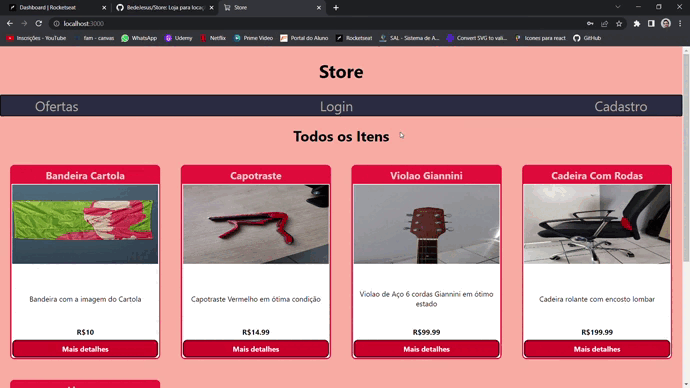
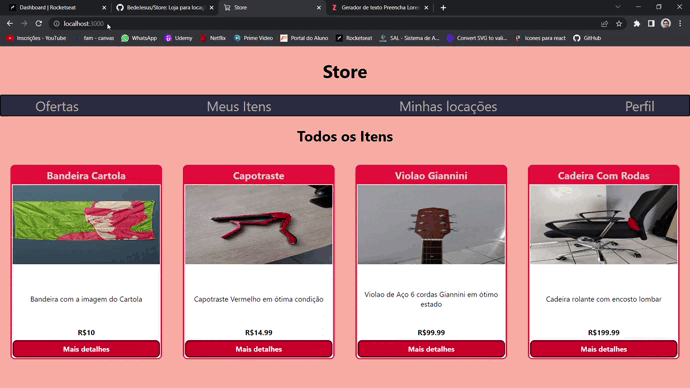
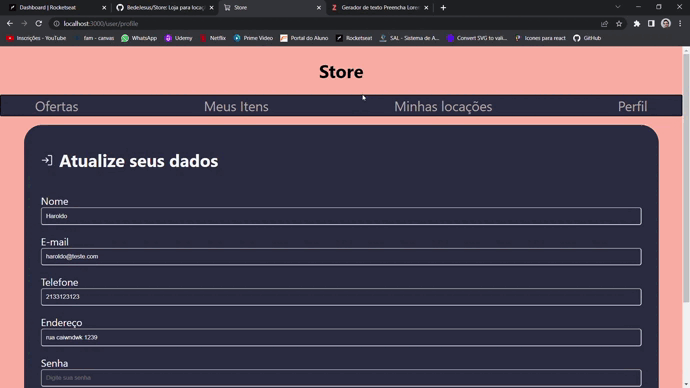
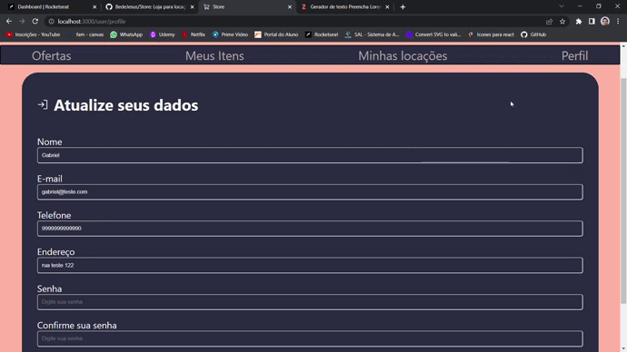

<h1>Store</h1>
👨‍💻 Site para os usuários poderem disponibilizar um item para locação,e também alugar itens de outros usuários. 
🧑🏽‍🦰 Uma pessoa não pode alugar o proprio item e pode colocar varios itens para locação. 
🪄 Utilização de JWT oara autenticação para login e cadastro do usuário. 
🛠️ O projeto está sendo atualizado. 
🤏🏽 Site totalmente responsivo.

<h2>Linguagens utilizadas:</h2>
    <h3>Front-end:</h3>
    - React JS
    <h3>Backend-end:</h3>
    - Node JS com Express como framework 
    - Mongodb como banco de dados e Mongoose como framework

    
<h2>Cadastro e login</h2>  

<h2>Cadastro e detalhes do item</h2>  

<h2>Edição e solicitação de locação</h2>  

<h2>Conclusão de locação de item</h2>  

