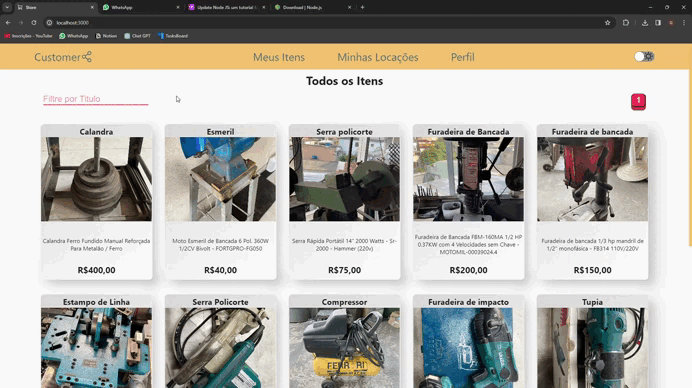

<h1>Customer Connection</h1>
👨‍💻 Aplicação web full-stack onde os usuários podem disponibilizar ferramentas para locação,e também alugar de outros usuários. 
🧑🏽‍🦰 Uma pessoa não pode alugar o proprio item e pode colocar varios itens para locação. 
🪄 Utilização de JWT para autenticação para login e cadastro do usuário. 
🔍 Itens paginados e filtráveis pelo usuario. 
🔛 Utilização de toogle switch para tema claro e escuro. 
🔑 Funcionalidade de "Esqueci minha senha" através do MailTrap. 
🔒 Senhas encriptadas com Bcrypt. 
💳 Integração com PayPal. 
🤏🏽 Aplicação totalmente responsiva. 
🚪 Acesse aqui: https://frontend-theta-weld-48.vercel.app/

<h2>Tecnologias Utilizadas</h2>
    <h3>Front-end</h3>
    - React JS  
    - Styled Components
    <h3>Back-end</h3>
    - Node JS com Express como framework 
    - Mongodb como banco de dados e Mongoose como framework

    
<h2>Cadastro e Login</h2>  

<h2>Assinatura</h2>  

<h2>Cadastro e Detalhes do Item</h2>  

<h2>Edição e Solicitação de Locação</h2>  

<h2>Conclusão de Locação de Item</h2>  

